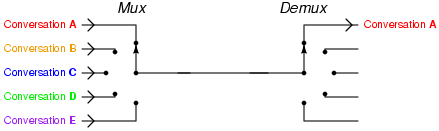
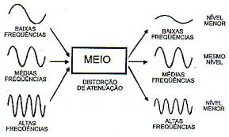
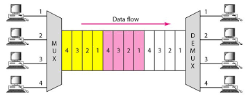

# Redes
# Introdução
## Mutiplexação em redes de comutação por circuitos:

**_Multiplexação** Consiste na transmissão de várias informações por um canal físico, ao
mesmo tempo. Na multiplexação, o dispositico chamado multiplexador tem como objetivo criar
diversos caminhos ou canais dentro de único meio físico. Essa operação pode ser feita por
meio de difereciação de freqência(FDM) ou por tempo(TDM).

**_FDM** o canal é dividido em bandas. Cada banda trabalha em uma frequência. Para cada frequência
emitida pelo multiplexador, ou MUX tem que haver uma mesma frequência de recebimento contidiano
são as estações de rádio FM, utilizado-se do meio "fisico" ar, a emissora de rádio estabelece uma
frequência de transmissão (88 MHz ate 108MHz), fazendo o papel do Multiplexador, e o seu rádio que
está sintonizado na sua estção FM preferida faz o papel de demultiplexador ou DEMUX.

**_TDM** Multiplexação por divisão de tempo. O

# Redes TCP e OSI

# Iterconexão rede

# Arquitetura e topologia

# Camadas de enlace rede

# Protocolo TCP/IP

# Como e o enderecamento IP

# Algorít e protocol roteam(básico)

# Segurança da informação(básico)

# Gerenciamento e Adminiostração de Redes(básico)
